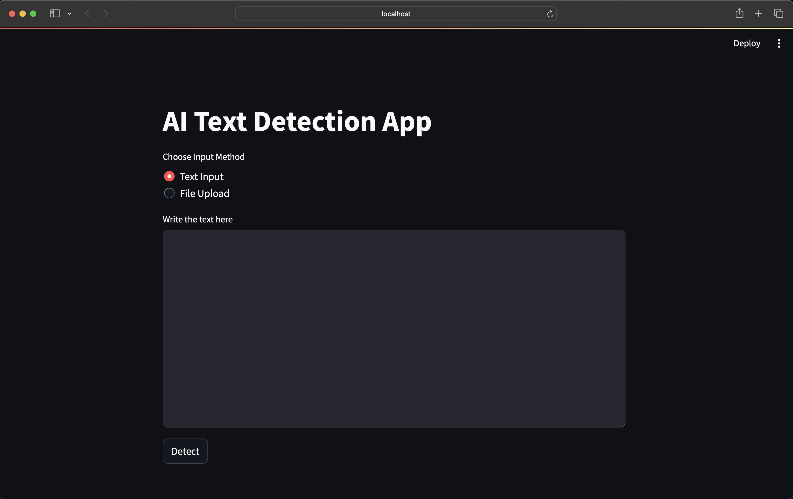

# AI Text Detector

### Large Language Model Generated Text Detection System
AI Text Detector is an open-source software project that aims to provide assistance to one of the most challenging task in recent times which is to detect whether a paragraph is human written on not. 

The software is able to take inputs from both textbox and files(i.e pdf, text). By analyzing the paragraph it highlights sentences based on whether it's human generated(green) AI generated(red) or it's uncertain(grey). 

### Project Overview
The project is divided by the following sections.

- Tokenization 
- Vectorization
- Model Training
- Model Deployment

### Installation
Clone the repository:

```git clone https://github.com/mahdiislam79/Artificial_text_detection.git```

To install the required packages, run the following command:

```pip install -r requirements.txt``` 

### Usage

To use the project, run the following commands:

```streamlit run streamlit.py``` 

Note: Before running the ```streamlit.py``` change the paths of the ```loaded_tokenizer```, ```loaded_vectorizer``` and ```loaded_model``` to the absolute path of those files after cloning the whole folder in your PC. You can find the saved model weights in ```saved_models``` folder. The combinations are either ```tokenizer.pkl, vectorizer.pkl, ensemble_model.sav``` or ```tokenizer_2.pkl, vectorizer_2.pkl, ensemble_model_2.sav```.

After running the ```streamlit.py``` file with the command above, you should be forwarded to the following web page:


##### It will be great to receive some advice regarding the project since it's just a prototype. I plan to work on both the models and the frontend in the future! Thanks for reading.
